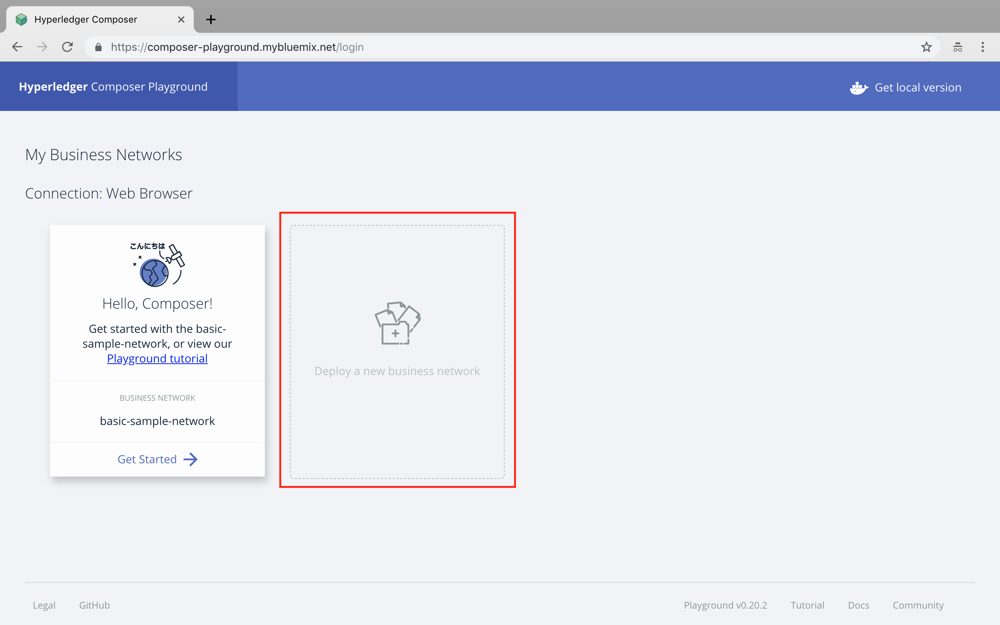
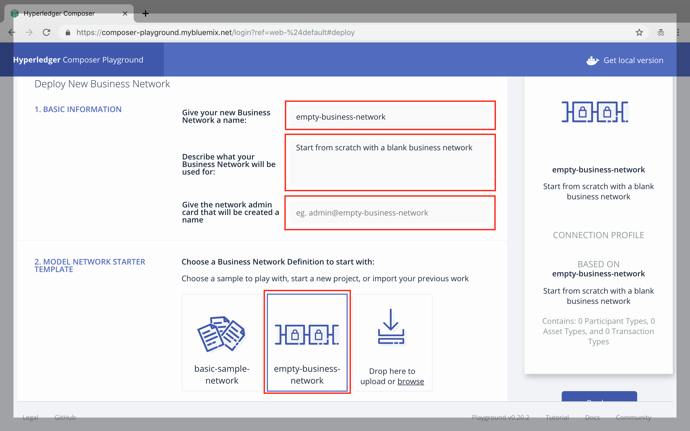
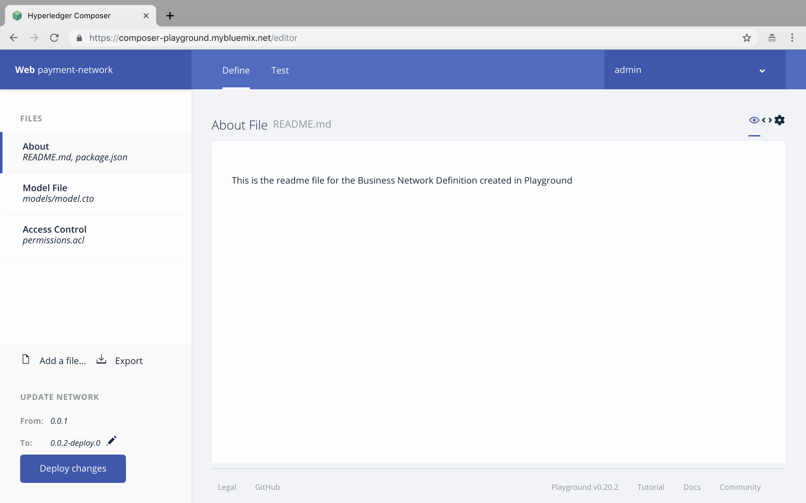
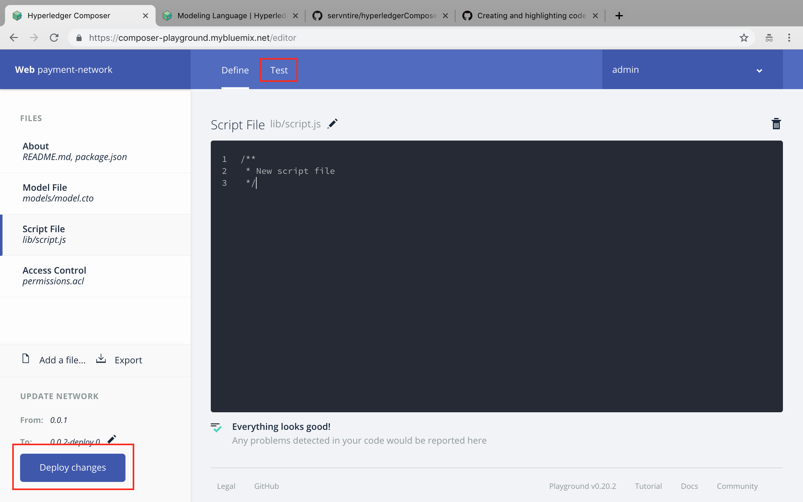
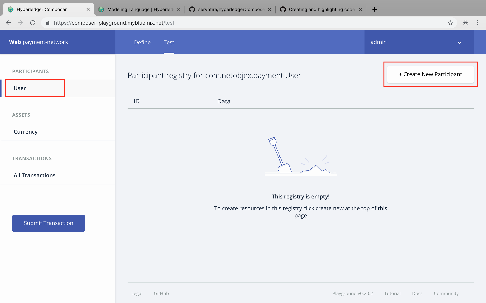
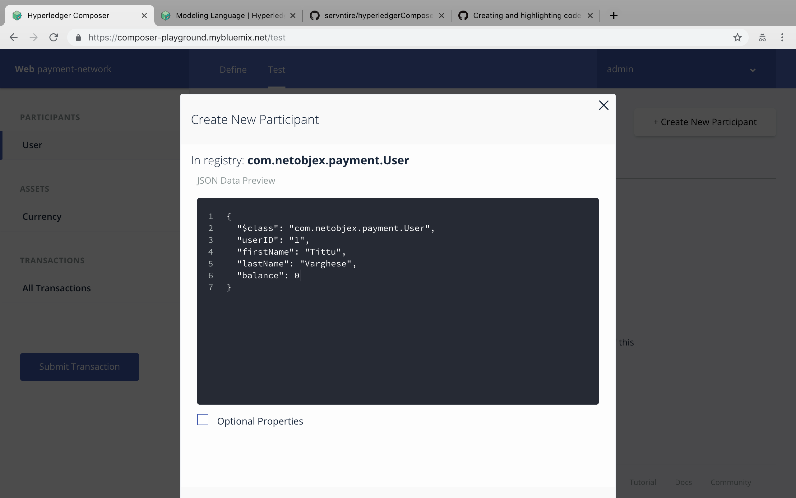
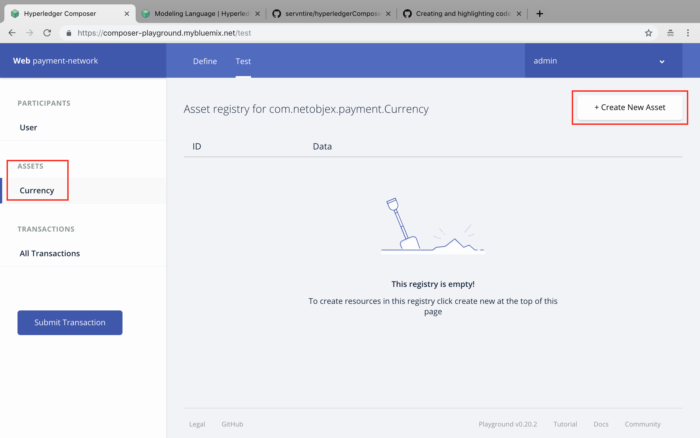
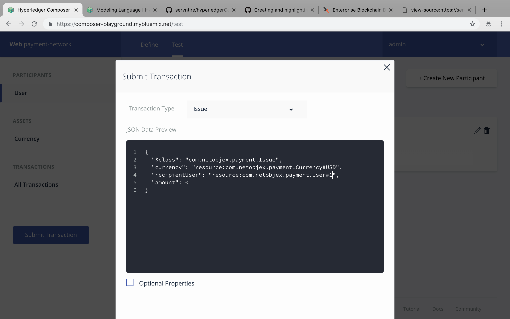

# Hyperledger Composer
Hyperledger Composer is an application development framework which simplifies and expedites the creation of Hyperledger fabric blockchain applications.

What we are going to develop is a payment system where a bank can issue asset / currency to a user. And user can transfer from his/her account to another account.

## 1. Getting Started
1. Open Chrome Browser (Download and Install chrome by visiting [https://www.google.com/chrome/](https://www.google.com/chrome/))
2. Visit [https://composer-playground.mybluemix.net/](https://composer-playground.mybluemix.net/) to start developing blockchain application using Hyperledger Composer.

## 2. Creating a Basic Network
We have to define a business network (nodes) and it's policies to start with the development process.
1. Click on Deploy a New Business Network

2. Give the informations as follows. Here we are defining the network parameters.
- Business Network Name - **payment-system**
- Description - **Any random Description**
- Network Admin Card - **Leave it blank**
- Model Network Starter Template - **Select empty-business-network**


## 3. Connecting to Business Network
Now you can see a screen with your business network in it.

**Click `Connect Now` to start the business network.**
You will get a screen as follows.


## 4. Structure of Composer
The Hyperledger Composer is mainly consist of 4 building blocs.
1. `CTO File` - Here we defines, Assets, Participants and various Transactions associated with the application.
2. `ACL File` - It's an access control file where we define various access permissions and policies to operate on the network.
3. `JS File` - It's a script file, Used to operate various functionalities on the ledger.
4. `QRY File` - Used to implement querying for ledger.

## 5. Development
First we are going to do is defining Asset, Participants and Transaction models in the `model.cto` file.
1. Define the namespace as `com.netobjex.payment`
2. Defining Currency as asset.
```js
asset Currency identified by currencySymbol {
  o String currencyName
  o String currencySymbol
  o String currencyDescription
  o Integer liquidity
}
```
***Generic Structure for Asset Definition***
```js
// String, Integer, Double, State, DateTime, Boolean
asset AssetName identified by keyword {
  o dataType fieldName
}
```
3. Defining Participants model
```js
participant User identified by userID {
  o String userID
  o String firstName
  o String lastName
  o Integer balance
}
```
***Generic Structure for Participant Definition***
```js
// String, Integer, Double, State, DateTime, Boolean
participant ParticipantModel identified by keyword {
  o dataType fieldName
}
```
4. Defining Transaction
```js
transaction Issue {
  --> Currency currency // Inheriting the model of Currency to currency
  --> User recipientUser // Inherting the model of User to recipientUser
  o Integer amount
}
```
***Generic Structure for Transaction Definition***
```js
// String, Integer, Double, State, DateTime, Boolean
transaction TransactionName {
  o dataType fieldName
}
```
5. Click on Add a file to Include a script file. Name it as `issue.js`
6. Here we are going to define the definition for Issue. (The transaction we defined above)
```js
/**
 * Issue money from bank to a user
 * @param {com.netobjex.payment.Issue} issue - issue of money to user
 * @transaction
 */
 async function issueMoney(issue) {
   issue.recipientUser.balance = issue.amount // Updating the Balance with Input Amount.
   let participantRegistry = await getParticipantRegistry('com.netobjex.payment.User'); // Retrieving Participant Registry
   await participantRegistry.update(issue.recipientUser);
 }
 ```
 7. Deploy changes and Click on Test.
 
 8. Create Participant
 
 
 9. Create Asset
 
 10. Submit a Transaction
 

## 6. Let's add more functionalities to it.
***Currently the problem is, balance is overwriting rather than adding it into the existing balance.***
Let's modify the `issueMoney` function in `issue.js` file slightly to add more functionality.
```js
async function issueMoney(issue) {
  const currentBalance = issue.recipientUser.balance
  issue.recipientUser.balance = issue.amount + currentBalance  
  let participantRegistry = await getParticipantRegistry('com.netobjex.payment.User');
  await participantRegistry.update(issue.recipientUser);
}
```
***Let's do a validation now, to check whether the issuer have enough fund before issuing the amount.***
```js
async function issueMoney(issue) {
  const liquidity = issue.currency.liquidity
  const currentBalance = issue.recipientUser.balance
  if(liquidity >= issue.amount) {
    issue.recipientUser.balance = issue.amount + currentBalance
    issue.currency.liquidity = liquidity - issue.amount
  } else {
    alert("Insufficient fund in Bank")
  }
  let participantRegistry = await getParticipantRegistry('com.netobjex.payment.User');
  let assetRegistry = await getAssetRegistry('com.netobjex.payment.Currency');
  await participantRegistry.update(issue.recipientUser);
  await assetRegistry.update(issue.currency);
}
```
## 7. Defining Transaction between participants.
First we have to define the transaction model. For that open model.cto and add following code.
1. Model definition
```js
transaction Transfer {
  --> User sender
  --> User receiver
  o Integer amount
}
```
2. Defining the transaction
Now we have to define the transaction based on the model defined.
Add a new script file. Name it as `transfer.js`
```js
/**
* Transfer of fund from one user to another
* @param {com.netobjex.payment.Transfer} transfer - fund transfer between users
* @transaction
*/
async function fundTransfer(transfer) {
    const senderBalance = transfer.sender.balance
    const receiverBalance = transfer.receiver.balance
    if(senderBalance >= transfer.amount) {
      transfer.receiver.balance = recieverBalance + transfer.amount
      transfer.sender.balance = senderBalance - transfer.amount
    } else {
      alert("Insufficient fund")
    }

  let participantRegistry = await getParticipantRegistry("com.netobjex.payment.User")
  await participantRegistry.update(transfer.receiver)
  await participantRegistry.update(transfer.sender)
}
```
3. Deploy and Test like we did before.
