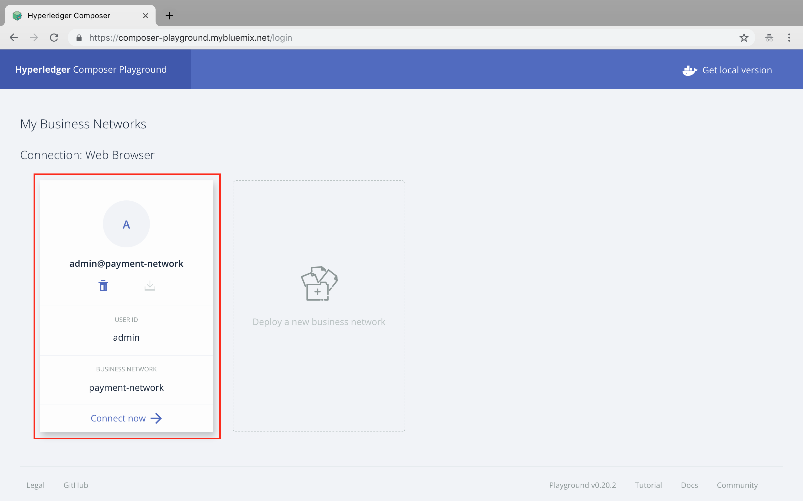

# Hyperledger Composer
Hyperledger Composer is an application development framework which simplifies and expedites the creation of Hyperledger fabric blockchain applications.

What we are going to develop is a payment system where a bank can issue asset / currency to a user. And user can transfer from his/her account to another account.

## 1. Getting Started
1. Open Chrome Browser (Download and Install chrome by visiting [https://www.google.com/chrome/](https://www.google.com/chrome/))
2. Visit [https://composer-playground.mybluemix.net/](https://composer-playground.mybluemix.net/) to start developing blockchain application using Hyperledger Composer.

## 2. Creating a Basic Network
We have to define a business network (nodes) and it's policies to start with the development process.
1. Click on Deploy a New Business Network

2. Give the informations as follows. Here we are defining the network parameters.
- Business Network Name - **payment-system**
- Description - **Any random Description**
- Network Admin Card - **Leave it blank**
- Model Network Starter Template - **Select empty-business-network**


## 3. Connecting to Business Network
Now you can see a screen with your business network in it.

**Click `Connect Now` to start the business network.**
You will get a screen as follows.


## 4. Structure of Composer
The Hyperledger Composer is mainly consist of 4 building blocs.
1. `CTO File` - Here we defines, Assets, Participants and various Transactions associated with the application.
2. `ACL File` - It's an access control file where we define various access permissions and policies to operate on the network.
3. `JS File` - It's a script file, Used to operate various functionalities on the ledger.
4. `QRY File` - Used to implement querying for ledger.

## 5. Development
First we are going to do is defining Asset, Participants and Transaction models in the `model.cto` file.
1. Define the namespace as `com.netobjex.payment`
2. Defining Currency as asset.
```JS
asset Currency identified by currencySymbol {
  o String currencyName
  o String currencySymbol
  o String currencyDescription
  o Integer liquidity
}
```
***Structure for Asset Definition***
```JS
// String, Integer, Double, State, DateTime, Boolean
asset AssetName identified by keyword {
  o dataType fieldName
}
```
